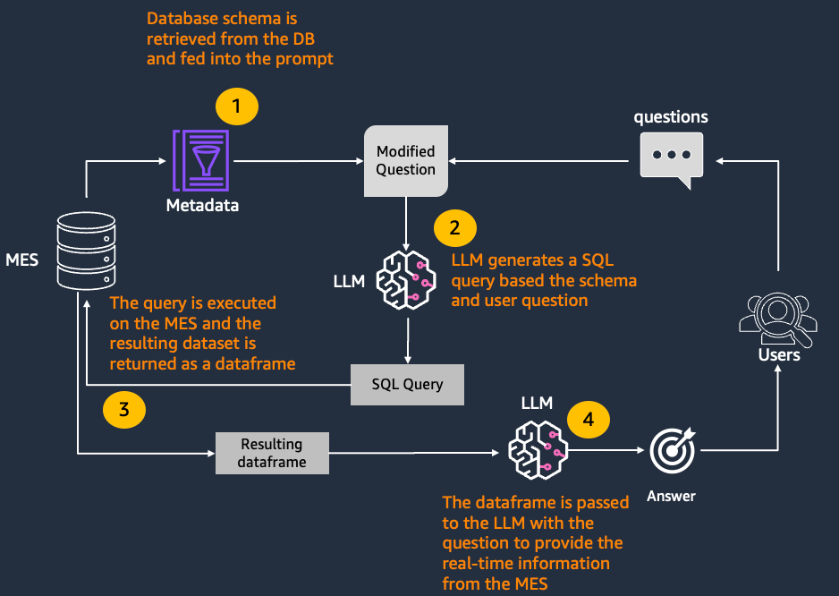
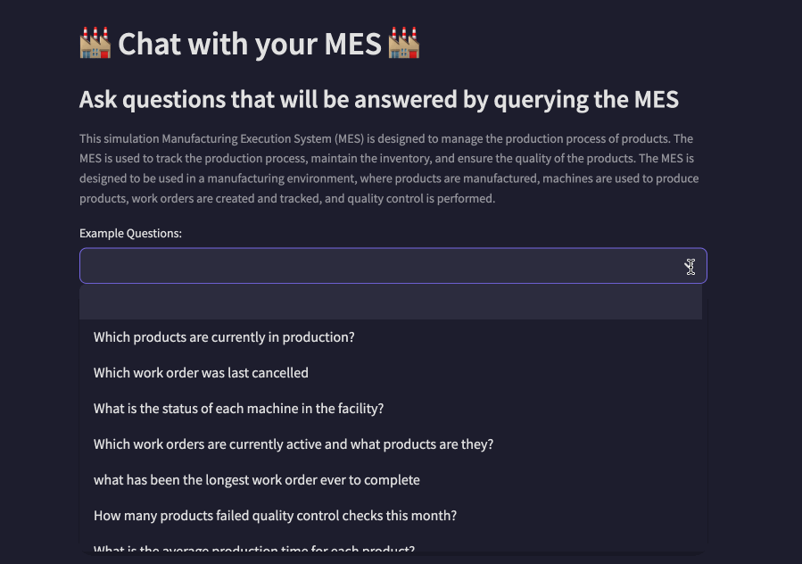

# MES Chatbot Interface Powered by Amazon Bedrock

## Overview

This project provides a conversational interface to query a Manufacturing Execution System (MES) database using natural language. It leverages Amazon Bedrock models to translate natural language questions into SQL queries, enabling manufacturing personnel to access operational data without SQL expertise.

The implementation includes a simulated MES database for an e-bike manufacturer and a Streamlit-based chat interface. The system uses the Amazon Bedrock Converse API with tool-calling capabilities to generate and execute SQL queries, then present the results in an easy-to-understand format.


## High-level Architecture Pattern



## Repo Content
This repository contains the following:
- [A simulation MES system based on SQLite](MES-synthetic-data/mes-simulation.md)
- [A streamlit-based chatbot](chatbot)
- [A Jupyter notebook](text-to-sql-notebook.ipynb) that can be used for educational purposes to understand the patterns used in this chatbot

## Key Capabilities

The chatbot interface enables users to:

1. **Query complex data with natural language**: Ask questions about production metrics, inventory levels, machine performance, and more
2. **Access operational insights quickly**: Generate reports on production output, maintenance schedules, and quality metrics
3. **Monitor equipment health**: Analyze machine performance and maintenance records
4. **Track quality metrics**: Review defect rates, quality control results, and yield data
5. **Manage inventory and supply chain**: Check stock levels, reorder points, and material consumption

## Prerequisites

- AWS account with access to Amazon Bedrock models
- Python 3.8+
- Required Python packages (listed in requirements.txt)

### Model Access

This project uses foundation models from Amazon Bedrock. You'll need to enable access to:

- **Claude 3 models**: Haiku or Sonnet
- **Amazon Nova models**: Supported models include Nova Micro, Nova Lite, and Nova Pro
If you only have access to a subset of those models, the application will work, but you will need to select a model you have access to.

See [Model access documentation](https://docs.aws.amazon.com/bedrock/latest/userguide/model-access.html) to enable model access in your AWS account.

## Setup Instructions

### 1. Environment Setup

If using Amazon SageMaker AI JupyterLab (recommended), you can skip to step 1.2.

Create and activate a Python virtual environment:

```bash
python3 -m venv .venv
source .venv/bin/activate
```

Configure AWS environment variables by creating a `.env` file:

```text
AWS_REGION="YourRegion" #example us-east-1
AWS_PROFILE="myprofile" #from ~/.aws/config
```

### 1.2 Install Required Packages

```bash
pip install -r requirements.txt
```

## 2. Creating the Simulated MES Database

### 2.1 Database Structure

The MES database includes tables for:

- Products and Bill of Materials
- Inventory and Suppliers
- Work Centers and Machines
- Employees and Shifts
- Work Orders and Production Schedules
- Quality Control and Defects
- Material Consumption
- Downtime Events
- OEE (Overall Equipment Effectiveness) Metrics

### 2.2 Generate Synthetic Data

```bash
# Create tables and simulation data
python3 MES-synthetic-data/sqlite-synthetic-mes-data.py
```

For additional options:

```bash
# Get help on configuration options
python3 MES-synthetic-data/sqlite-synthetic-mes-data.py --help
```

See [mes-simulation.md](MES-synthetic-data/mes-simulation.md) for detailed information on the simulation.

## 3. Chatbot Interface

> **Note**: This chatbot is designed for the demo database. For production use, implement proper security controls including read-only database access and SQL injection protection.

The Streamlit application demonstrates natural language interaction with the MES database. It features:

- In-memory conversation history
- Automatic schema retrieval
- SQL query generation and execution
- Error handling and query refinement
- Data visualization for appropriate query results
- Sample question suggestions

### Running the Interface

```bash
streamlit run chatbot/Chat.py
```

**For SageMaker JupyterLab**:
The Jupyter Server comes with a proxy and allows us to access our Streamlit app. Once the app is running, the user can initiate a separate session through the AWS Jupyter Proxy by adjusting the URL.

From a security aspect, the AWS Jupyter Proxy is extended by AWS authentication. As long as a user has access to the AWS account, Studio domain ID, and user profile, they can access the link. Access the streamlit application by modifying the Studio URL, replacing `lab?` with `proxy/[PORT NUMBER]/`

For example: `https://{domainId}.studio.{region}.sagemaker.aws/jupyterlab/default/proxy/8501/`

### Using the Chatbot

1. Select your preferred model from the dropdown (Claude 3 or Amazon Nova models)
2. Use the example questions or enter your own query
3. View the generated SQL, results, and AI-generated explanations
4. Ask follow up questions
5. Use the reset button to clear conversation history



## Security

See [CONTRIBUTING](CONTRIBUTING.md#security-issue-notifications) for more information.

## License

This library is licensed under the MIT-0 License. See the LICENSE file.
