# Manufacturing Operations Hub

Sample project demonstrating manufacturing operations interfaces using Amazon Bedrock and Strands Agents SDK. Includes **natural language queries against MES** (Manufacturing Execution System) data and dashboards for daily lean production meetings.


## Overview

This application provides two interfaces for manufacturing operations and an educational notebook:

1. **MES Insight Chat** - AI chatbot for querying Manufacturing Execution System (MES) data
2. **Daily Production Meeting** - Dashboard for daily lean meetings and production status reviews
3. **Educational Jupyter Notebook** - Demonstrates text-to-SQL patterns used in the chatbot

Built on a synthetic MES database for an e-bike manufacturing facility with production data, inventory, quality control, and equipment metrics.

## Key Features

### MES Insight Chat

- **AI Agents**: Strands SDK agents for multi-step database analysis
- **Multi-Step Reasoning**: Handles queries requiring multiple database operations
- **Error Recovery**: Automatic error diagnosis with recovery suggestions
- **Visualizations**: Agents select appropriate charts based on query results
- **Progress Tracking**: Live updates showing agent activity

### Daily Production Meeting

Reduces meeting prep time by providing pre-computed metrics and factory status. Teams arrive with answers to basic questions already available, allowing meetings to focus on actions and problem-solving.

Key benefits:
- Pre-computed production metrics (no slide preparation needed)
- Consistent view across stakeholders
- Natural language queries (e.g., "What are the top quality issues from yesterday?")
- AI insights highlighting patterns across domains
- Function-specific views:
  - Production: "What was our completion rate yesterday?"
  - Quality: "Which products have the highest defect rates?"
  - Equipment: "What machines need maintenance today?"
  - Inventory: "Which materials are below reorder level?"

Features:
- **Production Summary** - KPIs, completion rates, work orders
- **Equipment Status** - Machine availability, maintenance, downtime
- **Quality Issues** - Defect rates, top issues, problem products
- **Inventory Alerts** - Items below reorder level, days of supply
- **Productivity** - Employee and shift performance
- **Root Cause Analysis** - Defect analysis tools
- **AI Insights** - Daily cached analysis for fast loading
- **Action Items** - Track action items
- **Meeting Notes** - Document discussions
- **Reports** - Meeting summaries and weekly reports

### System Architecture

The system uses a schema-first text-to-SQL approach: the LLM learns the database structure, generates SQL from natural language queries, executes against the MES database, and returns results with visualizations. Includes error handling with query reformulation.

Sequence diagram:



```mermaid
sequenceDiagram
    participant User as 👤 User
    participant UI as ðŸ–¥ï¸ Streamlit UI
    participant Manager as 🤖 MES Agent Manager
    participant Agent as 🧠 MES Analysis Agent
    participant Tools as 🔧 Agent Tools
    participant DB as ðŸ—„ï¸ SQLite Database (MES)
    participant LLM as â˜ï¸ AWS Bedrock (Claude)

    Note over User, LLM: MES Chatbot Interaction Flow

    %% Initial Setup
    User->>UI: Launch MES Chat Application
    UI->>Manager: Initialize MES Agent Manager
    Manager->>Agent: Create MES Analysis Agent
    Agent->>LLM: Initialize with system prompt & tools
    Agent-->>Manager: Agent ready
    Manager-->>UI: Agent manager ready
    UI-->>User: Display chat interface

    %% User Query Processing
    User->>UI: Enter manufacturing query
    UI->>Manager: process_query(query, context)
    Manager->>Agent: analyze(query, context)
    
    %% Agent Analysis Process
    Agent->>LLM: Send query with system prompt
    
    Note over Agent, LLM: Agent uses specialized MES system prompt<br/>with manufacturing domain expertise
    
    LLM->>Tools: get_database_schema()
    Tools->>DB: PRAGMA table_info, sample data
    DB-->>Tools: Schema information
    Tools-->>LLM: Database structure & sample data
    
    LLM->>Tools: run_sqlite_query(sql_query)
    Tools->>DB: Execute SQL query
    DB-->>Tools: Query results
    Tools-->>LLM: Formatted results with metadata
    
    opt Visualization Needed
        LLM->>Tools: create_intelligent_visualization(data)
        Tools-->>LLM: Chart/graph data
    end
    
    LLM-->>Agent: Analysis response with insights
    Agent-->>Manager: Formatted response with metadata
    Manager-->>UI: Complete analysis result
    
    %% UI Display
    UI->>UI: Display analysis with formatting
    UI->>UI: Show progress updates
    UI->>UI: Generate follow-up suggestions
    UI-->>User: Present comprehensive results

    %% Error Handling Flow
    alt Database Error
        DB-->>Tools: SQLite error
        Tools->>Tools: Analyze error with IntelligentErrorAnalyzer
        Tools-->>LLM: Error analysis with recovery suggestions
        LLM-->>Agent: Error response with guidance
        Agent-->>Manager: Error result with alternatives
        Manager-->>UI: Error response with suggestions
        UI-->>User: Display error with recovery options
    end

    %% Follow-up Interaction
    opt User Selects Follow-up
        User->>UI: Click suggested follow-up question
        Note over UI, LLM: Process repeats with new query
    end

```

## Installation

### Prerequisites

- Python 3.10 or higher
- [uv](https://docs.astral.sh/uv/getting-started/installation/) - Modern Python package manager
- [SQLite](https://www.sqlite.org/download.html)
- [GNU Make](https://www.gnu.org/software/make/) - Build automation tool (usually pre-installed on macOS/Linux)
- AWS account with access to Amazon Bedrock
(see AWS Configuration section for required permissions and models)

### Setup

1. **Environment Setup**

   If using Amazon SageMaker AI JupyterLab (recommended), you can skip to step 3.

   Set up the project environment using uv:

   ```bash
   # Complete setup (install dependencies + create database)
   make setup
   
   # Or step by step:
   make install    # Install dependencies only via uv sync
   make setup-db   # Create database only
   ```

   This will automatically create a virtual environment and install all dependencies.

2. **AWS Configuration**

   Configure AWS environment variables by creating a `.env` file:

   ```text
   AWS_REGION="YourRegion" #example us-east-1
   AWS_PROFILE="myprofile" #from ~/.aws/config
   ```

3. **Generate the MES Database**

   ```bash
   # Create tables and simulation data (auto-detects if database exists)
   make setup-db
   ```

   This will create the database file `mes.db` in the project root directory if it doesn't exist, or refresh the data if it does.

   **Advanced Options**

   ```bash
   # Get help on all configuration options
   uv run app_factory/data_generator/sqlite-synthetic-mes-data.py --help
   
   # Or run with custom parameters
   uv run app_factory/data_generator/sqlite-synthetic-mes-data.py --config app_factory/data_generator/data_pools.json --lookback 60 --lookahead 7
   ```

4. **Set Up Daily Analysis Automation (Optional)**

   Automate the daily AI analysis by running it on a schedule. The analysis runs in parallel and takes ~1-2 minutes.

   ```bash
   # Set up systemd automation for daily analysis caching (Linux only)
   make setup-automation

   # Or run manually (all platforms)
   make run-analysis
   ```

   **Note**: Automated setup (`make setup-automation`) requires systemd (Linux). macOS users can run manually with `make run-analysis`.

   The scheduler:
   1. Generates fresh synthetic MES data (90 days historical, 14 days projected)
   2. Runs AI analysis across all production contexts (parallel execution)
   3. Caches results as JSON for fast retrieval
   4. Cleans up old cache files

   See [Daily Analysis Setup Guide](scripts/DAILY_ANALYSIS_SETUP.md) for configuration.

## Running the Applications

### Running the combined applications - chatbot and dashboards

```bash
# Start the combined application
uv run streamlit run app_factory/main.py
# Or use the Makefile shortcut
make start-dashboard
```

### Educational Jupyter Notebook

The repository includes a Jupyter notebook (`text-to-sql-notebook.ipynb`) that demonstrates the text-to-SQL patterns used in the chatbot. It's located at the root level for easy access to the database.

```bash
# Start Jupyter to access the notebook
uv run jupyter notebook
```

### Development and Testing

```bash
# Run tests
uv run pytest tests/
# Or: make test

# Clean up cache and temporary files
make clean

# View all available commands
make help
```

## Database and Simulation

The synthetic MES database (`mes.db`) models an e-bike production facility:

- **Products & BOM**: E-bikes, components, subassemblies, raw materials
- **Inventory & Suppliers**: Stock levels, reorder points, lead times
- **Work Centers & Machines**: Manufacturing areas, equipment, capacity
- **Employees & Shifts**: Personnel, skills, shift assignments
- **Work Orders**: Production schedules, actual production, status
- **Quality Control**: Inspection results, defects, root causes
- **Downtimes**: Equipment failures, planned maintenance
- **OEE Metrics**: Availability, Performance, Quality factors
- **Material Consumption**: Component usage, variance reporting

Simulation patterns:
- Production bottlenecks in specific work centers
- Shift-based completion rate variations (Morning: 88-98%, Night: 70-85%)
- Maintenance cycles affecting equipment performance
- Quality issues correlated with equipment and materials
- Inventory fluctuations and shortages
- Planned vs. unplanned downtime distributions

Use `--lookback` and `--lookahead` options to control date ranges when generating data.

## Project Structure

```text
./
├── LICENSE                      # MIT License
├── README.md                    # This file
├── CONTRIBUTING.md              # Contribution guidelines
├── CODE_OF_CONDUCT.md           # Code of conduct
├── pyproject.toml               # Project dependencies and metadata
├── .env                         # Environment variables (user-created)
├── .gitignore                   # Git ignore file
├── text-to-sql-notebook.ipynb   # Educational Jupyter notebook
├── app_factory/                 # Main application code
│   ├── main.py                  # Combined application entry point
│   ├── shared/                  # Shared utilities
│   │   ├── database.py          # Database access
│   │   └── bedrock_utils.py     # Amazon Bedrock client (for classic chat)
│   ├── mes_chat/                # MES Chat application
│   │   └── chat_interface.py    # AI agent-powered chat interface
│   ├── mes_agents/              # MES Chat AI Agents
│   │   ├── mes_analysis_agent.py    # Main analysis agent
│   │   ├── agent_manager.py         # Agent lifecycle management
│   │   ├── error_handling.py        # Error recovery
│   │   ├── config.py                # Agent configuration
│   │   └── tools/                   # Agent tools
│   │       ├── database_tools.py    # SQLite access
│   │       └── visualization_tools.py # Visualization tools
│   ├── production_meeting_agents/   # Production Meeting AI Agents
│   │   ├── production_meeting_agent.py  # Orchestrator + specialized agents
│   │   ├── agent_manager.py         # Agent lifecycle management
│   │   ├── error_handling.py        # Error recovery
│   │   ├── config.py                # Agent configuration
│   │   └── tools/                   # Agent tools
│   │       ├── database_tools.py    # SQLite access
│   │       └── visualization_tools.py # Visualization tools
│   ├── production_meeting/      # Production Meeting application
│   │   ├── dashboard.py         # Main dashboard
│   │   ├── dashboards/          # Individual dashboard components
│   │   │   ├── equipment.py     # Equipment status dashboard
│   │   │   ├── inventory.py     # Inventory dashboard
│   │   │   ├── production.py    # Production metrics dashboard
│   │   │   ├── productivity.py  # Productivity dashboard
│   │   │   ├── quality.py       # Quality issues dashboard
│   │   │   ├── root_cause.py    # Root cause analysis
│   │   │   └── weekly.py        # Weekly summary dashboard
│   │   ├── action_tracker.py    # Action item management
│   │   ├── report.py            # Meeting report generation
│   │   ├── ai_insights.py       # AI-powered insights
│   │   ├── daily_analysis_scheduler.py  # Daily analysis automation
│   │   └── analysis_cache_manager.py    # Analysis cache management
│   ├── data_generator/          # Database generator
│   │   ├── sqlite-synthetic-mes-data.py  # MES database generator
│   │   └── data_pools.json      # Configuration for database generator
│   └── data/                    # Data files
│       ├── sample_questions.json   # Example questions
│       └── meeting_templates.json  # Meeting templates
├── scripts/                     # Automation scripts
│   ├── setup_daily_analysis.py # Daily analysis setup (systemd)
│   └── run_daily_analysis.py    # Manual analysis runner
│   └── DAILY_ANALYSIS_SETUP.md  # Daily analysis setup guide
├── assets/                      # Images and media files
├── Makefile                     # Convenient command shortcuts
├── mes.db                       # Generated MES database (not in repo)
└── reports/                     # Generated reports directory (not in repo)
```


## Using the Applications

### MES Insight Chat

The MES Chat interface uses Strands SDK agents:

**Features:**
- Agents break down queries into logical steps
- Multi-step reasoning for complex analysis
- Error recovery with suggestions
- Progress tracking during execution
- Automatic visualization selection

Example queries:

- "Analyze production efficiency trends and identify bottlenecks"
- "What quality issues correlate with equipment downtime?"
- "Compare inventory consumption patterns across product lines"
- "Investigate root causes of recent defects"


### Daily Production Meeting

The Production Meeting dashboard includes:

1. **Production Summary** - Completion rates, OEE, work order status
2. **Equipment Status** - Machine availability, downtime, maintenance schedule
3. **Quality Issues** - Defects, problem products, root causes, trends
4. **Inventory Alerts** - Shortages, days of supply, material requirements
5. **Productivity** - Employee and shift performance
6. **Root Cause Analysis** - Drill into quality issues and patterns
7. **AI Insights** - Cached daily analysis with on-demand queries
8. **Action Items** - Track and assign action items
9. **Meeting Notes** - Document discussions and decisions
10. **Reports** - Meeting summaries and weekly reports

**Performance**: The AI Insights tab uses daily cached analysis for sub-second loading. Run `make run-analysis` to pre-generate insights, or use real-time analysis on demand.


## AWS Configuration

This application uses Amazon Bedrock for AI capabilities.

### Default Model

The application uses **Claude Haiku 4.5** (`us.anthropic.claude-haiku-4-5-20251001-v1:0`) via Amazon Bedrock cross-region inference. Configure in:
- `app_factory/mes_agents/config.py`
- `app_factory/production_meeting_agents/config.py`

### IAM Permissions

Your AWS role needs these permissions:

```json
{
  "Version": "2012-10-17",
  "Statement": [
    {
      "Effect": "Allow",
      "Action": [
        "bedrock:ListFoundationModels",
        "bedrock:GetFoundationModel",
        "bedrock:InvokeModel",
        "bedrock:InvokeModelWithResponseStream"
      ],
      "Resource": "*"
    }
  ]
}
```

Note: Narrow the Resource scope based on your deployment environment.

## License

This project is licensed under the MIT License - see the LICENSE file for details.
