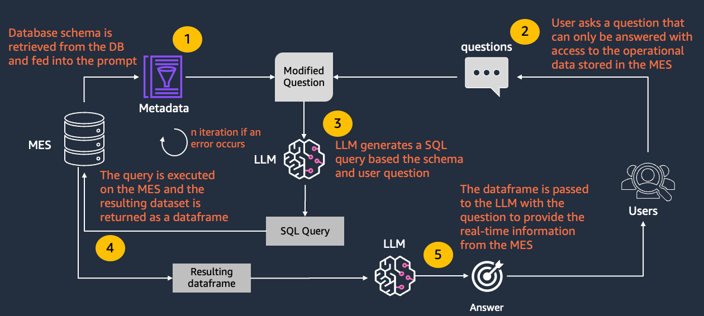

# Chatbot To Query Industrial Data Stores Powered by Amazon Bedrock

## Conversational Interface From Industrial Data Stores in Manufacturing: Revolutionizing Data Queries

In the modern manufacturing landscape, data-driven decision-making has become paramount. With the advent of Industry 4.0, manufacturing facilities are inundated with vast amounts of data from various sources such as sensors, machines, ERP systems, and more.

Generative AI technologies have made strides in bridging the gap between users and the vast amounts of textual data available. However, their focus has primarily been on text-based information, leaving a gap in accessing and interpreting operational data from complex industrial systems. Integrating these AI capabilities with a natural language interface that connects directly to operational data platforms can simplify this process. By doing so, it becomes easier for all users to access the real-time data needed for critical decision-making, without the need for deep technical expertise.

Navigating this sea of data to extract meaningful insights can be daunting, especially for those without extensive technical expertise in SQL or data analysis. This sample focuses on text-to-sql, but the same pattern can be used to query other industrial databases that may be powered by knowledge graphs, or other data stores.

The following is the high-level diagram of the chatbot that can be deployed with this sample code. It also stores the chat history in-memory.



### Use Cases in Manufacturing

**1. Simplified Access to Complex Data:** A conversational interface enables manufacturing personnel to query complex industrial data stores using simple natural language. For instance, a plant manager could ask, "Show me the production output of Machine A last week," and receive the relevant data without writing a single line of SQL code or have to consult a visualization tool that is tied to a specific system.

**2. Enhanced Operational Efficiency:** By democratizing data access, generative AI reduces the time and effort required to generate reports or analyze production metrics. This swift access to data empowers teams to make informed decisions quickly, enhancing overall operational efficiency.

**3. Proactive Maintenance and Downtime Reduction:** Maintenance teams can use natural language queries to assess the health and performance of equipment, identify potential issues before they escalate, and schedule preventative maintenance, thereby reducing unplanned downtime.

**4. Quality Control:** Quality assurance teams can easily query data related to product quality, defect rates, or batch inconsistencies using natural language, streamlining the quality control process and ensuring product standards are met consistently.

**5. Inventory and Supply Chain Management:** Inventory managers can effortlessly access real-time information about stock levels, reorder points, or supplier performance, optimizing inventory management and supply chain operations without needing to consult external applications or write complex queries.

### The Future is Now

Being able to interact with industrial data stores using natural language is not just futuristic concepts - these tools being integrated into manufacturing operations today. They bridge the gap between complex data systems and end-users, ensuring that actionable insights are just a question away. As we move forward, the adoption of such technologies will continue to grow, further transforming the manufacturing industry into a more efficient, data-savvy, and responsive domain.

## 0. Pre-requisites

This code sample leverages Anthropic Claude models on Amazon Bedrock. See [Model access](https://docs.aws.amazon.com/bedrock/latest/userguide/model-access.html) to enable model access. For smaller schemas, Claude Instant is recommended, for larger more complex ones, use Claude 2. Claude Instant will improve inference latency and minimize cost, but Claude 2.x has better reasoning capabilities.

## 1. Environment setup

> Note: If using this sample on `AWS Cloud9`, you can skip to step #1.2.

The following requires an installation of `python3`.

It is recommended to create a virtualenv

```bash
python3 -m venv .venv
```

After the `init` process completes and the virtualenv is created, you can use the following
step to activate your virtualenv.

```bash
source .venv/bin/activate
```

You will need access to your AWS environment. See [How to set environment variables](https://docs.aws.amazon.com/sdkref/latest/guide/environment-variables.html) for details.

Create a `.env` file in the root directory and add values for the following

```text
AWS_REGION="YourRegion" #example us-east-1
AWS_PROFILE="myprofile" #from ~/.aws/config
```

### 1.2 Install the required packages

To install the required packages, run the following command:

```bash
pip install -r requirements.txt
```

## 2. Creating the simulated MES

### 2.1 Installing PostgreSQL

This sample interacts with a simulated MES system that is backed by a postgres database. Feel free to use an existing postgres server of your choice, or simply deploy a test instance locally.

The following instructions, walk through installing and configuration of a PostgreSQL server, database creation, and generation of realistic synthetic data.

#### 2.1.1 Option 1 - Installing on AWS Cloud 9

The following installation script was developed for `Amazon Linux 2023`. If deploying on an `AWS Cloud9` instance, only SSM is required (no need to enable SSH nor setup a keypair), and an `m5.large` instance is recommended.

If using `Amazon Linux 2023`, you can install and configure test postgres database by running the following from the project directory:

```bash
chmod +x MES-synthetic-data/install_postgres.sh # adds executable permissions
./MES-synthetic-data/install_postgres.sh
```

This test instance will only listen in on `localhost` and will create the database username and password based on the values found in the user defined `postgres_creds.json`. The database will only be available locally, `localhost`. See [Client Authentication](https://www.postgresql.org/docs/current/client-authentication.html) in the official PostgreSQL documentation for additional details.

**Check PostgreSQL Service Status**: You can check the status of the PostgreSQL service to ensure it is active and running by running the following:

```bash
sudo systemctl status postgresql
```

A successful installation will result in a status of `active (running)`

**Verify database and user creation**: We can then connect to postgreSQL and verify that the database and user were properly created based on the values of `postgres_creds.json`

```bash
sudo -u postgres psql #connect using the psql client
```

Once in `psql`, list the databases and users:

```sql
\l
```

```sql
\d
```


You have now successfully completed the postgreSQL setup. Proceed to `step 2.2`.

#### 2.1.2 Option 2 - Installing manually

If running on a different system, you can alternatively install postgres without the above script and manually create the simulation MES database. You can follow the rest of the instructions as is to create the synthetic data. See [PostgreSQL Downloads](https://www.postgresql.org/download/) for details on installing postgres on your system.

If connecting to an existing system or using alternate credentials, edit `postgres_creds.json` with the appropriate values.

### 2.2 Generating synthetic data

This repository contains scripts to simulate a basic Manufacturing Execution System (MES) that manages and monitors the production process from raw materials to finished goods. The database structure is designed to track products, machinery, work orders, inventory levels, quality control, and employee details.

To create the database tables and populate them with synthetic data. From the project root directory, run:

```bash
# create tables
python3 MES-synthetic-data/create_tables.py
# simulate data
python3 MES-synthetic-data/mesdata-sim.py
```

### 2.3 Validate that the tables were successfully created

To validate the table creation and synthetic data generation, you can run the following:

From the terminal, connect using `psql` as the user created previously

```bash
export DB_USER=$(jq -r '.user' postgres_creds.json)
export PGPASSWORD=$(jq -r '.pwd' postgres_creds.json)
export DB_NAME=$(jq -r '.db_name' postgres_creds.json)
psql -U "$DB_USER" -d "$DB_NAME" -h localhost -W
```

List the tables. Then query one of the tables.

```sql
\dt
SELECT * FROM Products LIMIT 10;
```


This concludes the pre-requisites section and the system is now ready. An overview of the simulated MES is provided below.

### 2.4 Table Overview

To better understand the data we are working with, here's an overview of each table and its role within the system:

#### Products Table

- **Purpose**: Stores information about the products being manufactured.
- **Columns**:
  - `ProductID`: A unique identifier for each product, automatically generated.
  - `Name`: The name of the product, which is a required field.
  - `Description`: A text description of the product, which is optional.

#### Machines Table

- **Purpose**: Contains details about the machinery used in the manufacturing process.
- **Columns**:
  - `MachineID`: The unique identifier for each machine, automatically generated.
  - `Name`: The name of the machine.
  - `Type`: The type or category of the machine.
  - `Status`: The current status of the machine, restricted to 'running', 'idle', or 'maintenance' through a check constraint.

#### Work Orders Table

- **Purpose**: Tracks production work orders.
- **Columns**:
  - `OrderID`: A unique identifier for each work order, automatically generated.
  - `ProductID`: A reference to the `ProductID` in the Products table.
  - `Quantity`: The number of units to be produced, must be greater than 0.
  - `StartDate`: The start date of the work order.
  - `EndDate`: The expected end date of the work order.
  - `Status`: The current status of the work order.

#### Inventory Table

- **Purpose**: Manages inventory items, including materials or components.
- **Columns**:
  - `ItemID`: A unique identifier for each inventory item, automatically generated.
  - `Name`: The name of the inventory item.
  - `Quantity`: The current quantity in stock, must be non-negative.
  - `ReorderLevel`: The quantity at which more of the item should be ordered, also must be non-negative.

#### Quality Control Table

- **Purpose**: Records the outcomes of quality control checks for work orders.
- **Columns**:
  - `CheckID`: A unique identifier for each quality control check, automatically generated.
  - `OrderID`: A reference to the `OrderID` in the Work Orders table.
  - `Date`: The date when the quality control check was performed.
  - `Result`: The result of the quality control check.
  - `Comments`: Optional comments about the check.

#### Employees Table

- **Purpose**: Stores details about employees involved in the manufacturing process.
- **Columns**:
  - `EmployeeID`: A unique identifier for each employee, automatically generated.
  - `Name`: The name of the employee.
  - `Role`: The role or job title of the employee.
  - `Shift`: The work shift of the employee.

This database structure is designed to facilitate the coordination and optimization of the production process, tracking key components of a manufacturing execution system.

## 3. Chatbot Interface

> Disclaimer: The chatbot is designed to operate with this demo database. If using against a real system, make sure that the user connecting the database has read-only access and to implement guardrails that would ensure the database would not get overloaded and apply SQL injection protections.

A demo streamlit application has been built to demonstrate how one can interact with an MES system using a natural language interface by asking questions about the data.

It implements in-memory storage for conversation history and is designed to generate SQL Queries and execute them against the simulated MES. It will automatically retrieve the database metadata (tables, column names, data types, sample data) to allow it to generate accurate queries. If an error is returned during the query, it will attempt to re-write the query based on the error returned. Finally, once it has retrieved the data from the system, it will use this information to answer the original user question.

Since this is built for demo purposes, it also shows intermediary steps in the console and will display the query generated in the chat interface. Processing time is also provided to the user: the time to generate the SQL query and the time to generate the response from the data returned by the query and the original question.

You can use the **reset button** to clear the chat history and ask a new question.

Some sample questions are provided. As this is a demo, the application has been set to show what happens in a more verbose way, so it will also show the specific SQL queries generated, how long it took to execute, and the result set returned from the MES to answer the question.

To start the streamlit app, simply run:

```bash
streamlit run chatbot/Chat.py --server.port 8080
```

> If running this example in AWS Cloud9, you can access the streamlit app by clicking `Preview -> Preview Running Application` from the menu at the top of the screen. This way, you can access it securely without exposing any ports to the internet.

On the sidebar (left-hand side), you can reset the chat to clear the chat history and ask a new question. You can use one of the example questions provided or ask your own in the chat box at the bottom.


## Security

See [CONTRIBUTING](CONTRIBUTING.md#security-issue-notifications) for more information.

## License

This library is licensed under the MIT-0 License. See the LICENSE file.
