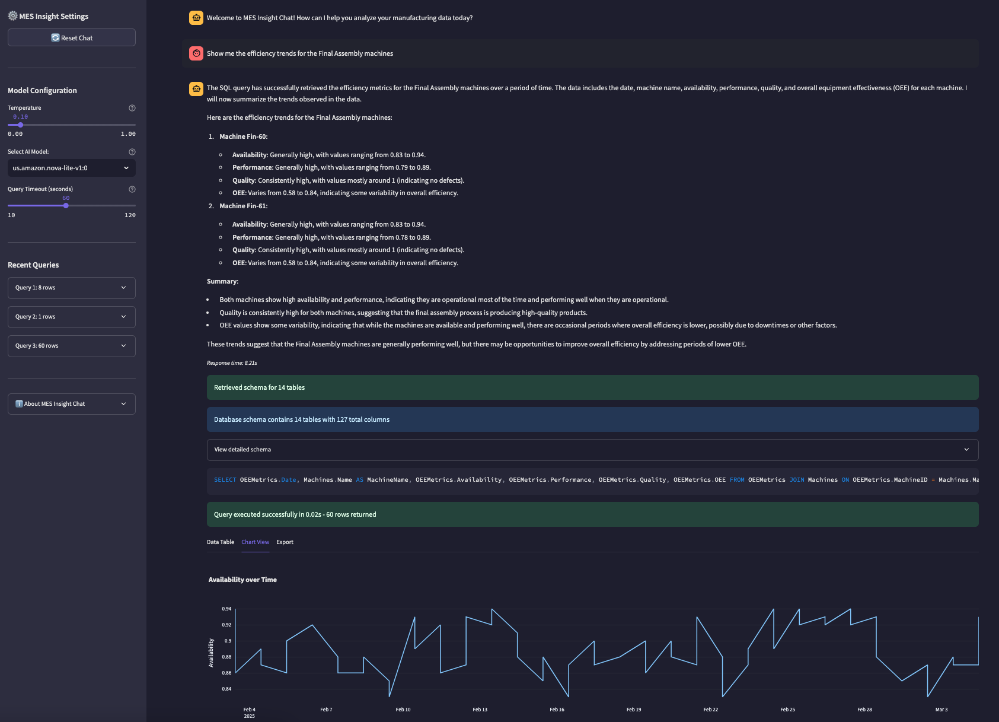
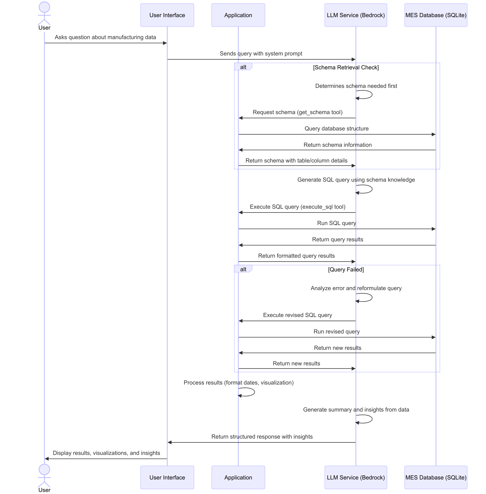

# Manufacturing Operations Hub

A comprehensive platform providing manufacturing operations interfaces powered by Amazon Bedrock. This project offers a combination of **natural language interaction with MES** (Manufacturing Execution System) data structured dashboards for daily lean production meetings with AI data analysis.



## Overview

This application provides two integrated interfaces for manufacturing operations:

1. **MES Insight Chat** - An interactive AI-powered chatbot for analyzing Manufacturing Execution System (MES) data
2. **Daily Production Meeting** - A structured interface for daily lean meetings and production status reviews
3. **Educational Jupyter Notebook** - A demonstration of text-to-SQL patterns used in the chatbot

The application is built on a synthetic MES database for an e-bike manufacturing facility, providing a realistic environment for exploring production data, inventory management, quality control, and equipment efficiency metrics.

## Key Features

### MES Insight Chat

- **🤖 AI Agents**: Intelligent agents powered by Strands SDK for sophisticated analysis
- **🧠 Multi-Step Reasoning**: Handles complex queries requiring multiple database operations
- **🛠️ Smart Error Recovery**: Automatic error diagnosis and intelligent recovery suggestions
- **📊 AI-Selected Visualizations**: Agents choose the best charts for your data
- **📚 Educational Guidance**: Learn better query techniques as you explore data
- **⚡ Real-Time Progress**: See what agents are doing with live progress updates

### Daily Production Meeting

The Daily Production Meeting dashboard eliminates the need for teams to spend a lot of preparation time by, for example, gathering data and running pivot table reports before meetings. Instead, team members arrive with answers to the basic questions already available and an overview of the state of the factory, allowing the meeting to focus on actions and solving problems.

Key benefits include:
- Instant access to critical production metrics - no more preparing slides before meetings
- Real-time dashboards that present a consistent view across all stakeholders
- Natural language querying of top issues (e.g., "What are the top quality issues from yesterday that we should investigate?")
- AI-powered insights that highlight patterns humans might miss
- Function-specific views that allow teams to quickly answer common questions:
  - Production: "What was our completion rate yesterday?"
  - Quality: "Which products have the highest defect rates?"
  - Equipment: "What machines need maintenance today?"
  - Inventory: "Which materials are below reorder level?"

Features include:
- **📈 Production Summary** - KPIs, completion rates, and current work orders
- **🔧 Equipment Status** - Machine availability, upcoming maintenance, and downtime impact
- **⚠️ Quality Issues** - Defect rates, top issues, and problem products
- **📦 Inventory Alerts** - Items below reorder level with days of supply analysis
- **👥 Productivity** - Employee and shift performance metrics
- **🔍 Root Cause Analysis** - Interactive defect analysis tools
- **🤖 AI Insights** - Predictive analytics and decision intelligence
- **📋 Action Items** - Track and manage action items
- **📝 Meeting Notes** - Document discussions and decisions
- **📄 Reports** - Generate meeting summaries and weekly reports

### System Architecture

This architecture enables natural language queries against manufacturing databases using LLMs. The system follows a schema-first approach where the LLM first learns the database structure before generating SQL queries. When users ask questions in plain English, the application bridges the gap between natural language and structured data by having the LLM generate appropriate SQL, execute it against the MES database, and then transform the results into insightful, business-relevant responses with visualizations. The pattern includes error handling with query reformulation when needed, ensuring robust performance even with complex manufacturing questions.

This is the Sequence Diagram of the chatbot:



## Installation

### Prerequisites

- Python 3.10 or higher
- [uv](https://docs.astral.sh/uv/getting-started/installation/) - Modern Python package manager
- [SQLite](https://www.sqlite.org/download.html)
- AWS account with access to Amazon Bedrock
(see AWS Configuration section for required permissions and models)

### Setup

1. **Environment Setup**

   If using Amazon SageMaker AI JupyterLab (recommended), you can skip to step 3.

   Set up the project environment using uv:

   ```bash
   uv sync
   ```

   This will automatically create a virtual environment and install all dependencies.

2. **AWS Configuration**

   Configure AWS environment variables by creating a `.env` file:

   ```text
   AWS_REGION="YourRegion" #example us-east-1
   AWS_PROFILE="myprofile" #from ~/.aws/config
   ```

3. **Install Required Packages**

   Dependencies are automatically installed with `uv sync` in step 1. If you need to add new packages:

   ```bash
   uv add <package-name>
   ```

4. **Generate the MES Database**

   ```bash
   # Create tables and simulation data (auto-detects if database exists)
   uv run python app_factory/data_generator/sqlite-synthetic-mes-data.py --config app_factory/data_generator/data_pools.json --lookback 90 --lookahead 14
   ```

   This will create the database file `mes.db` in the project root directory if it doesn't exist, or refresh the data if it does.

   **Additional Options**

   ```bash
   # Get help on all configuration options
   uv run python app_factory/data_generator/sqlite-synthetic-mes-data.py --help
   ```

## Running the Applications

You can run the applications independently or together:

### Run All Components Together

```bash
# Start the combined application
uv run streamlit run app_factory/app.py
```

### Run Components Independently

```bash
# Run only the MES Insight Chat
uv run streamlit run app_factory/mes_chat/app.py

# Run only the Daily Production Meeting
uv run streamlit run app_factory/production_meeting/app.py
```

### Educational Jupyter Notebook

The repository includes a Jupyter notebook (`text-to-sql-notebook.ipynb`) that demonstrates the text-to-SQL patterns used in the chatbot. It's located at the root level for easy access to the database.

```bash
# Start Jupyter to access the notebook
uv run jupyter notebook
```

## Database and Simulation

The synthetic MES database (`mes.db`) contains a comprehensive manufacturing data model for an e-bike production facility, including:

- **Products & BOM**: E-bikes, components, subassemblies, and raw materials with hierarchical bill of materials
- **Inventory & Suppliers**: Stock levels, reorder points, lead times, and supplier information
- **Work Centers & Machines**: Manufacturing areas, equipment capabilities, capacity, and status
- **Employees & Shifts**: Personnel profiles, skills, shift assignments, and work schedules
- **Work Orders**: Production schedules, actual production, and order status tracking
- **Quality Control**: Inspection results, defects, root causes, severity, and corrective actions
- **Downtimes**: Equipment failures, planned maintenance, and operational interruptions
- **OEE Metrics**: Overall Equipment Effectiveness tracking (Availability, Performance, Quality)
- **Material Consumption**: Component usage, variance reporting, and lot tracking

The simulation includes realistic manufacturing patterns such as:
- Production bottlenecks and constraints in specific work centers
- Maintenance cycles affecting equipment performance over time
- Quality issues correlated with process variables, equipment, and materials
- Inventory fluctuations and occasional shortages with lead time impacts
- Downtime events with appropriate distributions (planned vs. unplanned)
- Seasonal and weekly production patterns reflecting real-world manufacturing

Use the configuration options to control the date ranges and data characteristics when generating the database.

## Project Structure

```text
./
├── LICENSE                      # MIT License
├── README.md                    # This file
├── CONTRIBUTING.md              # Contribution guidelines
├── CODE_OF_CONDUCT.md           # Code of conduct
├── pyproject.toml               # Project dependencies and metadata
├── .env                         # Environment variables (user-created)
├── .gitignore                   # Git ignore file
├── text-to-sql-notebook.ipynb   # Educational Jupyter notebook
├── app_factory/                 # Main application code
│   ├── app.py                   # Combined application entry point
│   ├── shared/                  # Shared utilities
│   │   ├── database.py          # Database access
│   │   └── bedrock_utils.py     # Amazon Bedrock client (for classic chat)
│   ├── mes_chat/                # MES Chat application
│   │   └── app.py               # AI agent-powered chat interface
│   ├── mes_agents/              # AI Agents (New!)
│   │   ├── mes_analysis_agent.py    # Main intelligent agent
│   │   ├── agent_manager.py         # Agent lifecycle management
│   │   ├── error_handling.py        # Smart error recovery
│   │   ├── config.py               # Agent configuration
│   │   └── tools/                  # Agent tools
│   │       ├── database_tools.py   # Enhanced SQLite access
│   │       └── visualization_tools.py # AI-powered visualizations
│   ├── production_meeting/      # Production Meeting application
│   │   ├── app.py               # Main dashboard
│   │   ├── dashboards/          # Individual dashboard components
│   │   │   ├── equipment.py     # Equipment status dashboard
│   │   │   ├── inventory.py     # Inventory dashboard
│   │   │   ├── production.py    # Production metrics dashboard
│   │   │   ├── productivity.py  # Productivity dashboard
│   │   │   ├── quality.py       # Quality issues dashboard
│   │   │   ├── root_cause.py    # Root cause analysis
│   │   │   └── weekly.py        # Weekly summary dashboard
│   │   ├── action_tracker.py    # Action item management
│   │   ├── report.py            # Meeting report generation
│   │   └── ai_insights.py       # AI-powered insights
│   ├── data_generator/          # Database generator
│   │   ├── sqlite-synthetic-mes-data.py  # MES database generator
│   │   └── data_pools.json      # Configuration for database generator
│   └── data/                    # Data files
│       ├── sample_questions.json   # Example questions
│       └── meeting_templates.json  # Meeting templates
├── assets/                      # Images and media files
├── mes.db                       # Generated MES database (not in repo)
└── reports/                     # Generated reports directory (not in repo)
```

## Using the Applications

### MES Insight Chat

The MES Chat interface uses intelligent AI agents powered by the Strands SDK:

**🤖 AI Agent Features:**
- Intelligent agents that break down complex questions into logical steps
- Multi-step reasoning for sophisticated manufacturing analysis
- Smart error recovery with educational guidance
- Real-time progress tracking and partial results
- AI-selected visualizations based on data characteristics

Example questions for AI agents:

- "Analyze our production efficiency trends and identify bottlenecks"
- "What quality issues correlate with equipment downtime?"
- "Compare inventory consumption patterns across product lines"
- "Investigate root causes of recent defects and suggest improvements"


### Daily Production Meeting

The Production Meeting dashboard includes:

1. **Production Summary** - Daily production metrics, completion rates, OEE, and real-time work order status
2. **Equipment Status** - Machine availability, downtime analysis, and upcoming maintenance schedule
3. **Quality Issues** - Top defects, problem products, root causes, and trend analysis
4. **Inventory Alerts** - Critical shortages, days of supply analysis, and material requirements
5. **Productivity** - Employee and shift performance metrics with comparative analysis
6. **Root Cause Analysis** - Interactive tools to drill into quality issues and identify patterns
7. **AI Insights** - AI-powered analytics including predictive insights and decision intelligence
8. **Action Items** - Track and assign action items to team members
9. **Meeting Notes** - Document discussions and decisions with templates
10. **Reports** - Generate comprehensive meeting summaries and weekly reports

The dashboard updates in real-time, providing a consistent view for all stakeholders and eliminating the need for manual report preparation before meetings. This allows teams to focus on problem-solving rather than data collection and reporting.


## AWS Configuration

This application uses Amazon Bedrock for natural language understanding and AI capabilities. The following configuration is required:

### IAM Permissions

Your AWS role needs these specific permissions:

```json
{
  "Version": "2012-10-17",
  "Statement": [
    {
      "Effect": "Allow",
      "Action": [
        "bedrock:ListFoundationModels",
        "bedrock:GetFoundationModel",
        "bedrock-runtime:InvokeModel"
      ],
      "Resource": "*" //narrow the scope based on where you run this application
    }
  ]
}
```

### Required Model Access

You must enable at least one model in Amazon Bedrock that supports **System Prompt**, **Converse API**, and **Tool use**.

Compatible models include Anthropic Claude 3.x models, Amazon Nova, Mistral, etc. See [Supported models and features](https://docs.aws.amazon.com/bedrock/latest/userguide/conversation-inference-supported-models-features.html) for the full list.

To enable these models see [Add or remove access to foundation models](https://docs.aws.amazon.com/bedrock/latest/userguide/model-access-modify.html)

## License

This project is licensed under the MIT License - see the LICENSE file for details.
